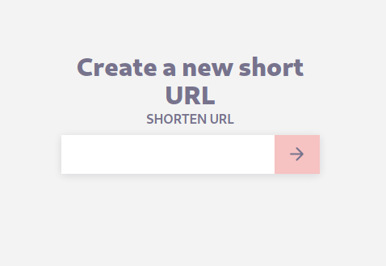

[![Contributors][contributors-shield]][contributors-url]
[![Issues][issues-shield]][issues-url]
[![MIT License][license-shield]][license-url]
[![pipeline status][pipeline-shield]][pipeline-url]

# Nim URL Shortener

<!-- Don't forget to add your badges (License, CI, Code coverage) -->

**Nim URL Shortener** is a web application that allows you to do shorten an URL - similar to popular services like [bit.ly](https://bitly.com/) or [TinyURL](https://tinyurl.com/).

This is a learning project to improve my knowledge of **[Nim][nim]**.

[][livedemo]

You can see a **[LIVE DEMO on Heroku][livedemo]**.

## Built With

- [Nim][nim]
- [Jester][jester]

## Installation

The project uses [Docker](https://www.docker.com/) and [docker-compose](https://docs.docker.com/compose/). Developed on a Linux machine.

- docker-compose version 1.25.2
- Docker version 19.03

Clone the repository:

```bash
git clone git@github.com:sophiabrandt/NimUrlShortener.git
```

## Usage

Move into the cloned folder and spin up the docker containers:

```bash
cd NimUrlShortener
docker-compose up --build
```

Visit `http://localhost:5001` in your browser.

### Tests

Start the docker containers in the background, then run the test with `nimble`:

```bash
docker-compose up -d
docker-compose exec url-shortener nimble c -r src/database_test
```

## Contributing

Pull requests are welcome. For major changes, please open an issue first to discuss what you would like to change.

1. Fork the Project
2. Create your Feature Branch (`git checkout -b feature/AmazingFeature`)
3. Commit your Changes (`git commit -m 'Add some AmazingFeature'`)
4. Push to the Branch (`git push origin feature/AmazingFeature`)
5. Open a Pull Request

## License

&copy; 2020 Sophia Brandt. Distributed under the MIT License. See [LICENSE](LICENSE) for details.

## Contact

Twitter: [@hisophiabrandt](https://twitter.com/hisophiabrandt)

[nim]: https://nim-lang.org/
[jester]: https://github.com/dom96/jester

## Acknowledgements

- [Nim Days](https://github.com/xmonader/nimdays) by Ahmed Thabet
- [Nim in Action](https://www.manning.com/books/nim-in-action) by [Dominik Picheta](https://github.com/dom96/)
- [Front-End Challenges Club](https://front-end-challenges.club/) by Andy Bell

[contributors-shield]: https://img.shields.io/github/contributors/sophiabrandt/NimUrlShortener.svg?style=flat-square
[contributors-url]: https://github.com/sophiabrandt/NimUrlShortener/graphs/contributors
[issues-shield]: https://img.shields.io/github/issues/sophiabrandt/NimUrlShortener.svg?style=flat-square
[issues-url]: https://github.com/sophiabrandt/NimUrlShortener/issues
[license-shield]: https://img.shields.io/github/license/sophiabrandt/NimUrlShortener.svg?style=flat-square
[license-url]: https://github.com/sophiabrandt/NimUrlShortener/LICENSE
[pipeline-shield]: https://gitlab.com/sophiabrandt/NimUrlShortener/badges/master/pipeline.svg
[pipeline-url]: https://gitlab.com/sophiabrandt/NimUrlShortener/commits/master
[livedemo]: https://obscure-chamber-78463.herokuapp.com/
